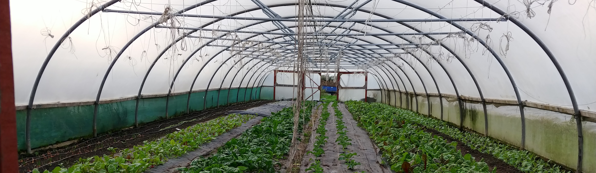

## Welcome to the Hawes Lab

The Hawes Social-Environmental Systems Research Group studies **sustainability, resilience, and justice** in coupled natural-human systems. We are based at the [University of Wyoming](https://www.uwyo.edu), where Jake Hawes is jointly appointed in the [School of Computing](https://www.uwyo.edu/cosc/) and the [Haub School of Environment and Natural Resources](https://www.uwyo.edu/haub/).

Our work draws on planning, geography, and engineering to understand how built, natural, and social systems interact — and how thoughtful design and policy can promote more equitable and resilient outcomes. Current research focuses on **urban agriculture**, **critical infrastructure resilience**, and **community adaptive capacity to natural hazards**.

---

## About Jake

Jake Hawes is an Assistant Professor co-appointed between the School of Computing and the Haub School of Environment and Natural Resources at the University of Wyoming. His research deploys mixed methods and interdisciplinary analysis to model coupled natural-human systems across scales — from individual farmers to regional food-energy-water systems.

Jake earned his PhD from the University of Michigan School for Environment and Sustainability, and holds a BS in Environmental and Ecological Engineering and an MS in Natural Resources Social Science from Purdue University. His work has been supported by NSF, USDA, and Sea Grant, and has appeared in journals including *Nature Cities*, *Landscape and Urban Planning*, and *Environmental Science & Technology*.

📧 Reach Jake at [jhawes@uwyo.edu](mailto:jhawes@uwyo.edu)

---

## News & Updates

- **Spring 2025** — New paper published in *Nature Cities*: [Comparing the carbon footprints of urban and conventional agriculture](https://www.nature.com/articles/s44284-023-00023-3)
- **Fall 2025** — Jake begins teaching new courses at the intersection of computing and coupled natural-human systems at UW
- **The lab is actively recruiting a postdoc.** Interested? Send your CV and a brief statement of interests (≤2 pages) to [jhawes@uwyo.edu](mailto:jhawes@uwyo.edu)

---

## Explore the Site

- [**Lab Members**](/lab-members/) — Meet the team
- [**Projects**](/projects/) — Current and past research
- [**Publications**](/publications/) — Journal articles and papers
- [**Talks**](/talks/) — Presentations and invited lectures
- [**Teaching**](/teaching/) — Courses at UW
